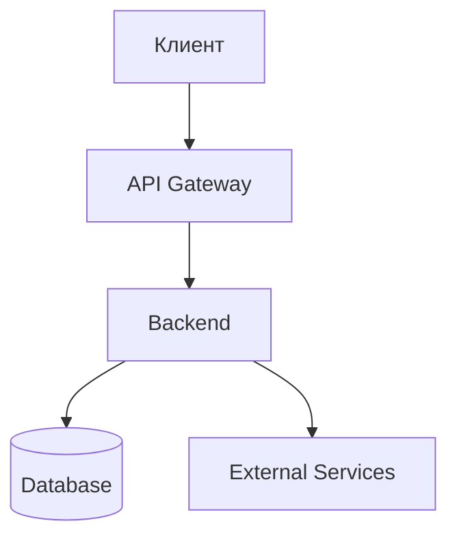

# 🏗️ Architecture — Как устроено

> Техническая архитектура проекта. AI читает перед крупными изменениями.

---

## Общая схема



## Стек

| Компонент | Технология | Версия |
|-----------|-----------|--------|
| Backend | [Python/Node/Go] | [версия] |
| Database | [PostgreSQL/MongoDB] | [версия] |
| Frontend | [React/Vue/TMA] | [версия] |
| Hosting | [VPS/Cloud] | — |

## Структура проекта

```
project/
├── src/           # Исходный код
│   ├── api/       # HTTP endpoints
│   ├── bot/       # Telegram bot handlers
│   ├── models/    # Database models
│   └── services/  # Business logic
├── tests/         # Тесты
├── deploy/        # Скрипты деплоя
├── docs/          # Документация
└── .agent/rules/  # AI правила
```

## Ключевые решения

> Смотри полный список: `DECISIONS.md`

1. **[Решение 1]** — почему [краткое объяснение]
2. **[Решение 2]** — почему [краткое объяснение]

## Ограничения

- [ограничение 1]
- [ограничение 2]
